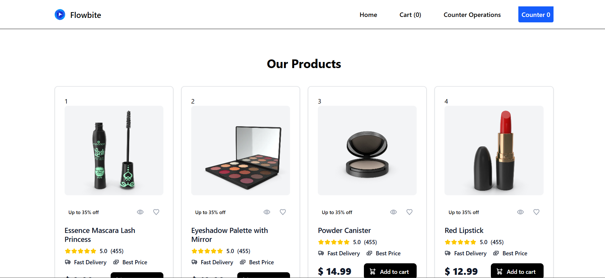
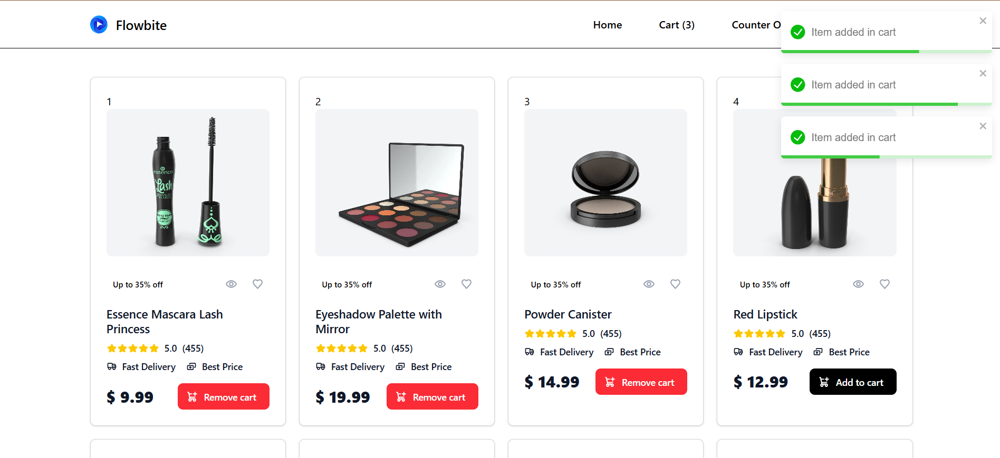
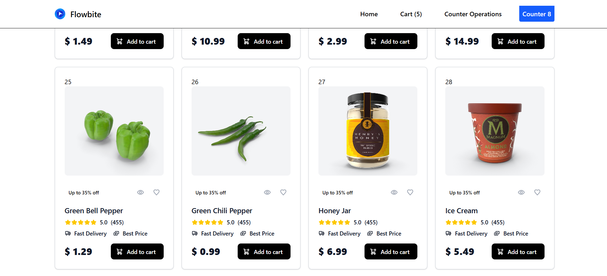
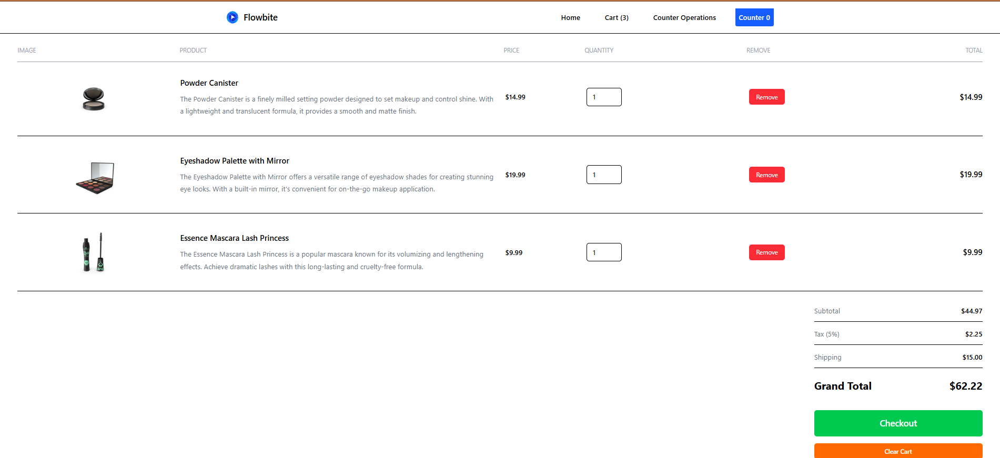
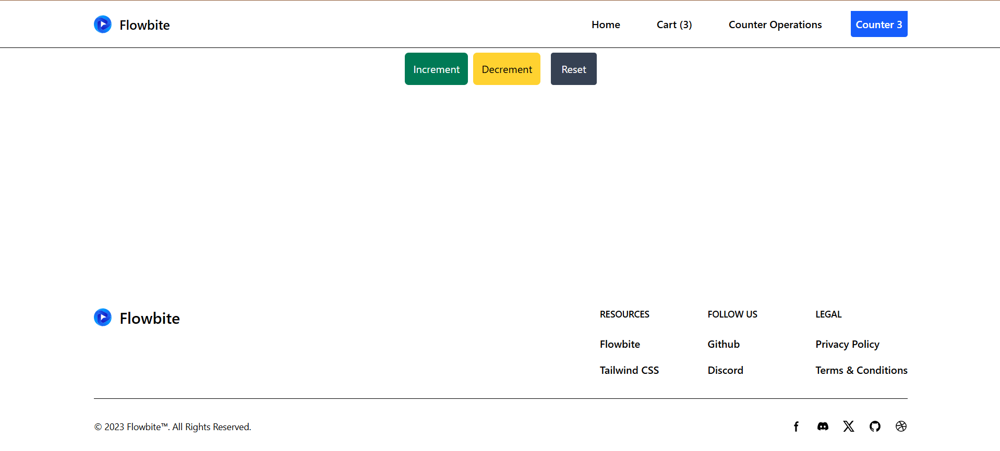

# 🛒 Redux Cart & Counter — React + Redux Toolkit



**A modern cart-based web application demonstrating global state management with Redux Toolkit**

[](https://react.dev/)
[](https://redux-toolkit.js.org/)
[](https://vitejs.dev/)
[](https://tailwindcss.com/)

---

## 📌 Table of Contents

- [About the Project](#-about-the-project)
- [Features](#-features)
- [Screenshots](#-screenshots)
- [Tech Stack](#-tech-stack)
- [Project Structure](#-project-structure)
- [Pages & Components](#-pages--components)
- [State Management](#️-state-management)
- [API Used](#-api-used)
- [Responsive Design](#-responsive-design)
- [Getting Started](#-getting-started)
- [Available Scripts](#-available-scripts)
- [Dependencies](#-dependencies)
- [Learning Objectives](#-learning-objectives)
- [Development Journey](#️-development-journey)
- [Future Enhancements](#-future-enhancements)
- [Acknowledgements](#-acknowledgements)
- [License](#-license)

---

## 📖 About the Project

**Redux Cart & Counter** is a practice project built with **React 19** and **Redux Toolkit**, created to explore global state management the "proper" Redux way — using `createSlice`, `configureStore`, `useSelector`, and `useDispatch`.

The app is split into two demonstration modules: a **product cart** (fetching live product data from the DummyJSON API via Axios, with full add/remove/clear cart functionality) and a **counter** (increment/decrement/reset), both backed by their own Redux slices under a single centralized store. The UI is styled entirely with **Tailwind CSS** and includes toast notifications for user feedback.

---

## ✨ Features

### 🛍️ Product Module

- Fetches live product data from the **DummyJSON API** using Axios
- Responsive product cards showing image, title, description, rating, and price
- Loading and error states while data is being fetched
- Clean, modern UI styled with Tailwind CSS

### 🛒 Product Cart

- Add products to the cart
- Remove individual products from the cart
- Clear the entire cart in one action
- Live cart item count displayed in the navbar
- Cart state managed globally via Redux Toolkit (`CartSlice`)

### 🔢 Counter Module

- Increment, decrement, and reset a shared counter value
- Counter state managed globally via Redux Toolkit (`CounterSlice`), so its value persists across navigation

### ⚛️ Redux Toolkit Architecture

- Multiple feature-based Redux slices (`CartSlice`, `CounterSlice`)
- Centralized store configuration via `configureStore`
- `react-redux` bindings (`useSelector` / `useDispatch`) throughout the UI

### 🎨 UI & UX

- Fully responsive layout
- Modern product card design
- Toast notifications for cart actions (add/remove/clear)
- Clean, consistent navigation via `Header`/`Footer`/`MainLayout`

---

## 📸 Screenshots

### 🏠 Home Page



### 🛍️ Product Listing



### 🛒 Cart



### 🔢 Counter



_Screenshots coming soon._

---

## 🚀 Tech Stack

| Technology         | Version | Purpose                      |
| ------------------ | ------- | ---------------------------- |
| **React**          | 19.2.7  | Core frontend framework      |
| **Redux Toolkit**  | 2.12.0  | Global state management      |
| **React Redux**    | 9.3.0   | React bindings for Redux     |
| **React Router**   | 8.2.0   | Client-side routing          |
| **Axios**          | 1.18.1  | HTTP client for API requests |
| **Tailwind CSS**   | 4.3.2   | Utility-first styling        |
| **Vite**           | 8.1.1   | Build tool and dev server    |
| **React Toastify** | 11.1.0  | Toast notifications          |

---

## 📂 Project Structure

```
redux-toolkit-project/
│
├── public/
│
├── src/
│   ├── assets/
│   │   ├── hero.png
│   │   ├── react.svg
│   │   └── vite.svg
│   │
│   ├── Components/
│   │   └── Common/
│   │       ├── Footer.jsx            → Site-wide footer
│   │       ├── Header.jsx            → Navbar with live cart item count
│   │       └── MainLayout.jsx        → Shared layout wrapper (Header + Footer + content)
│   │
│   ├── Pages/
│   │   ├── Home.jsx                  → Product listing (fetches from DummyJSON)
│   │   ├── Cart.jsx                  → Cart view (add/remove/clear)
│   │   └── CounterButtons.jsx        → Increment/decrement/reset counter demo
│   │
│   ├── redux/
│   │   ├── CartSlice.js              → Cart state, reducers & actions
│   │   ├── CounterSlice.js           → Counter state, reducers & actions
│   │   └── store.js                  → Centralized Redux store configuration
│   │
│   ├── App.jsx                       → Root component & route definitions
│   ├── main.jsx                      → React DOM entry point
│   ├── App.css
│   └── index.css
│
├── index.html
├── package.json
├── package-lock.json
├── vite.config.js
└── README.md
```

---

## 📄 Pages & Components

### `App.jsx`

Root component that sets up routing and renders `MainLayout` around every page.

### `MainLayout.jsx` / `Header.jsx` / `Footer.jsx`

- `MainLayout` wraps every route with a consistent `Header` and `Footer`
- `Header` reads the cart's `totalQuantity` from the Redux store via `useSelector` to display a live item count
- `Footer` renders shared site-wide footer content

### `Home.jsx`

- Fetches product data from the DummyJSON API using Axios on mount
- Renders a responsive grid of product cards (image, title, description, rating, price)
- Handles loading and error states
- "Add to Cart" action dispatches `addItem()` to the Redux store and triggers a toast notification

### `Cart.jsx`

- Reads the current cart array from the Redux store via `useSelector`
- Lists each cart item with a remove action (`removeItem()`)
- Includes a "Clear Cart" action (`clearCart()`)

### `CounterButtons.jsx`

- Reads the current count from the Redux store via `useSelector`
- Increment / decrement / reset buttons dispatch the corresponding `CounterSlice` actions

---

## 🗂️ State Management

The project uses a single, centralized **Redux store** built with Redux Toolkit's `configureStore`:

```javascript
import { configureStore } from "@reduxjs/toolkit";
import counterSlice from "./CounterSlice";
import cartSlice from "./CartSlice";

const store = configureStore({
  reducer: {
    counterStore: counterSlice,
    cartStore: cartSlice,
  },
});

export default store;
```

### 🔢 Counter Slice

**State**

```javascript
{
  count: 0;
}
```

**Actions**

- `increment()`
- `decrement()`
- `reset()`

### 🛒 Cart Slice

**State**

```javascript
{
  cart: [],
  totalQuantity: 0
}
```

**Actions**

- `addItem()`
- `removeItem()`
- `clearCart()`

---

## 🌐 API Used

**DummyJSON Products API**

```
https://dummyjson.com/products
```

Used with Axios in `Home.jsx` to fetch and display product data for the cart module.

---

## 📱 Responsive Design

The application is fully responsive and optimized across:

- 💻 Desktop
- 💼 Laptop
- 📱 Tablet
- 📲 Mobile Devices

---

## 🚀 Getting Started

### Prerequisites

- **Node.js** (v18 or higher recommended)
- **npm** or **yarn**

### Installation

```bash
# 1. Clone the repository
git clone https://github.com/Yashtagad12/Redux-Toolkit.git

# 2. Navigate into the project directory
cd redux-toolkit-project

# 3. Install dependencies
npm install

# 4. Start the development server
npm run dev
```

Open `http://localhost:5173` to view it in the browser.

---

## 📜 Available Scripts

| Script            | Description                           |
| ----------------- | ------------------------------------- |
| `npm run dev`     | Starts the Vite development server    |
| `npm run build`   | Builds the app for production         |
| `npm run preview` | Previews the production build locally |
| `npm run lint`    | Runs ESLint for code quality checks   |

---

## 📦 Dependencies

```json
{
  "dependencies": {
    "@reduxjs/toolkit": "^2.12.0",
    "@tailwindcss/vite": "^4.3.2",
    "axios": "^1.18.1",
    "react": "^19.2.7",
    "react-dom": "^19.2.7",
    "react-redux": "^9.3.0",
    "react-router": "^8.2.0",
    "react-toastify": "^11.1.0",
    "tailwindcss": "^4.3.2"
  }
}
```

---

## 🎯 Learning Objectives

This project was built to practice:

- Redux Toolkit fundamentals — `createSlice()`, `configureStore()`
- Reading and updating global state with `useSelector()` and `useDispatch()`
- Client-side routing with React Router
- API integration with Axios
- Component-based architecture
- Toast notifications for user feedback
- Utility-first styling with Tailwind CSS
- Core React Hooks (`useState`, `useEffect`)

---

## 🛤️ Development Journey

1. **Project Setup** — Initialized with Vite + React 19, configured Tailwind CSS
2. **Layout** — Built `Header`, `Footer`, and `MainLayout` for a consistent shell across pages
3. **Counter Module** — Implemented `CounterSlice` and wired up increment/decrement/reset via Redux Toolkit
4. **Redux Store** — Set up centralized `configureStore` combining the counter and cart reducers
5. **Product Fetching** — Built `Home.jsx` to fetch and display products from the DummyJSON API using Axios
6. **Cart Module** — Implemented `CartSlice` (add/remove/clear) and connected it to `Home.jsx` and `Cart.jsx`
7. **UX Polish** — Added toast notifications for cart actions and a live cart count in the navbar
8. **Responsive Styling** — Applied Tailwind's responsive utilities across all pages

---

## 🔮 Future Enhancements

- [ ] Product details page
- [ ] Search products
- [ ] Category filter
- [ ] Wishlist
- [ ] User authentication
- [ ] Quantity update buttons (increment/decrement per cart item)
- [ ] Checkout page
- [ ] Payment integration
- [ ] Local storage persistence for cart state
- [ ] Dark mode

---

## 🙌 Acknowledgements

- Product data provided by [DummyJSON](https://dummyjson.com/)
- State management powered by [Redux Toolkit](https://redux-toolkit.js.org/)
- Built and developed as a practice project to learn Redux Toolkit fundamentals

---

## 📃 License

This project is created for learning purposes and is free to use.

---

_🛒 Redux Cart & Counter — Practice project exploring global state management_
